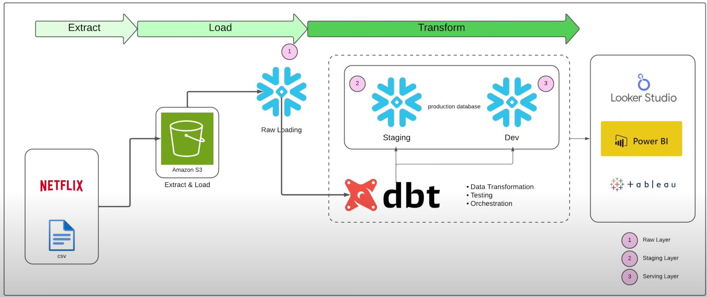
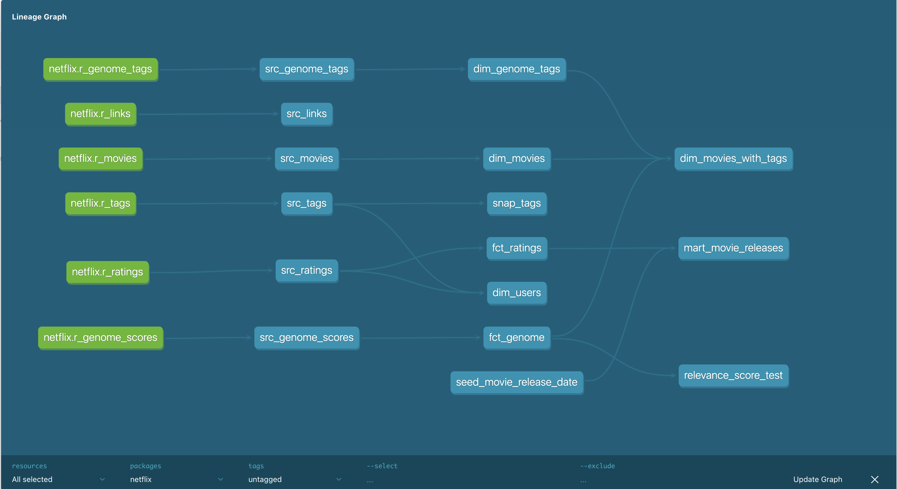

# 🎥 Netflix-Scale Analytics Pipeline

A full-stack data analytics project simulating a real-world Netflix-style workflow using the modern data stack: **Amazon S3**, **Snowflake**, **dbt**, and **Power BI**.

---

## 🔧 Tech Stack

- **Amazon S3** – raw data ingestion
- **Snowflake** – ELT, staging, warehousing
- **dbt** – SQL-based transformations, modeling, testing, orchestration
- **Power BI** – live, filterable BI dashboards

---

## 📌 Project Overview

This pipeline ingests raw CSVs (MovieLens format), loads them into Snowflake using `COPY INTO`, and transforms them via dbt into structured dimensional models and fact tables. Final data is exposed to BI tools for analysis.

---

## 🗂️ Architecture

### Layers

| Layer            | Description                                                           |
|------------------|-----------------------------------------------------------------------|
| **Raw Layer**     | Raw CSVs stored in S3 and loaded into Snowflake via external stage    |
| **Staging Layer** | Cleaned and typed versions of raw tables (`src_*`)                    |
| **Serving Layer** | Dimensional, fact, and mart models consumed by dashboards             |

---

## 🔄 Data Lineage

### Sample Flow:
- `netflix.r_movies` → `src_movies` → `dim_movies` → `dim_movies_with_tags` → `mart_movie_releases`
- Snapshots: `snap_tags` (SCD Type 2 tracking)

---

- **Materializations Used:** `view`, `table`, `incremental`  
- **Tests Implemented:** `not_null`, `unique`, `relationships`  
- **Snapshots:** `snap_tags` with Type 2 tracking  

## 🔐 Access Control

- Configured **Snowflake RBAC** with a scoped `TRANSFORM` role  
- Power BI Studio connected using secure credentials  
- BI users only see serving-layer models

## 📊 Dashboards (Power BI Studio)

- 🎥 **Top Movies by Avg Rating**  
- 🎭 **Genre-wise Avg Ratings** (using `LATERAL FLATTEN`)  
- 👤 **Most Active Users**  
- 📅 **Yearly Release Trends**  
- 🏷️ **Top Tags by Genome Relevance**

## ✅ Highlights

- ✅ 14+ modular dbt models across raw, staging, dim, fact, mart layers  
- ✅ Incremental loading for large tables like `src_ratings`  
- ✅ Snapshots for SCD Type 2 on tags  
- ✅ Model-level lineage tracking using `dbt docs`  
- ✅ End-to-end ELT pipeline using modern cloud tools  

## 📁 Sample Data

Based on the public [MovieLens dataset](https://grouplens.org/datasets/movielens/)  
Stored as CSV files in S3 and loaded to Snowflake using external stage + `COPY INTO`.

## Acknowledgments
- Special thanks to [@darshilparmar](https://github.com/darshilparmar) for this project.

